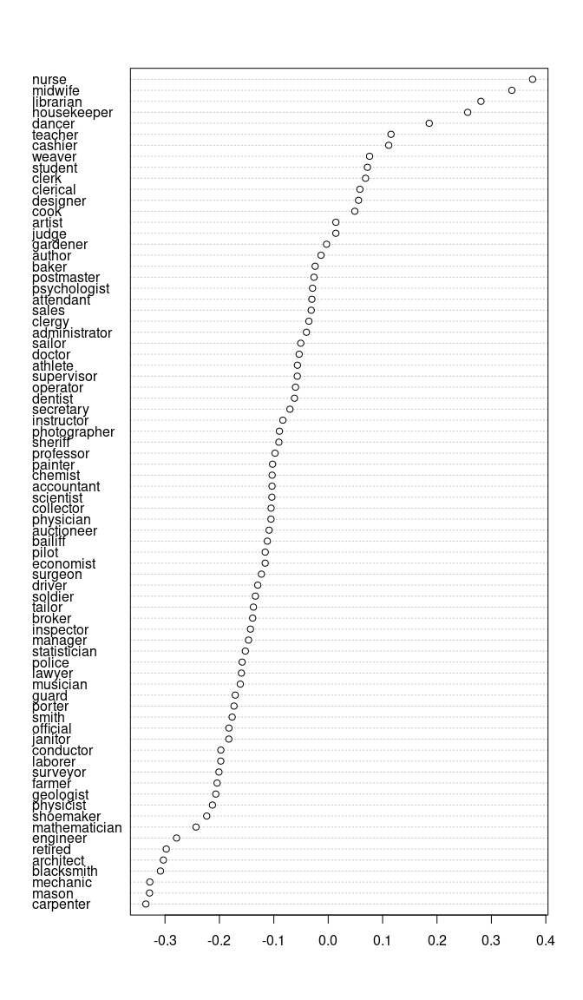
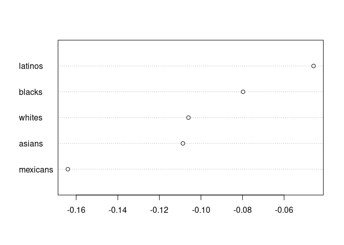
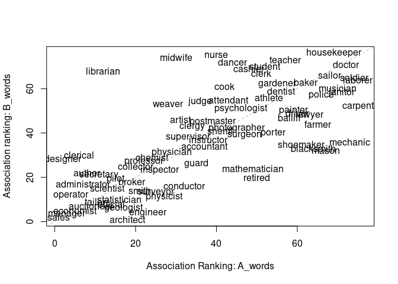
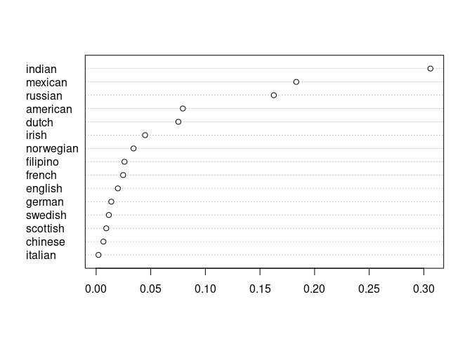
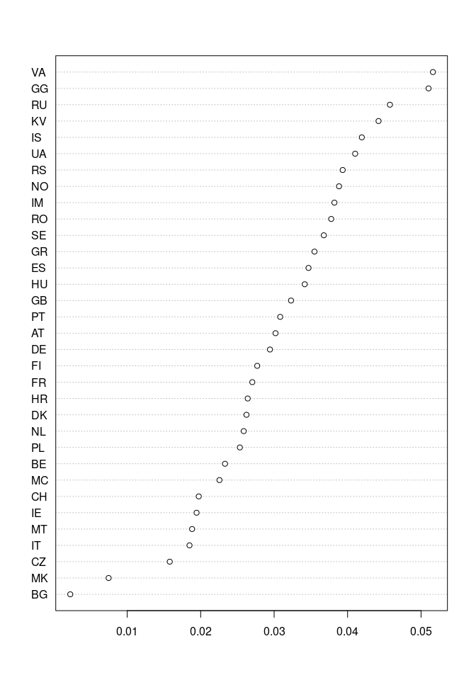
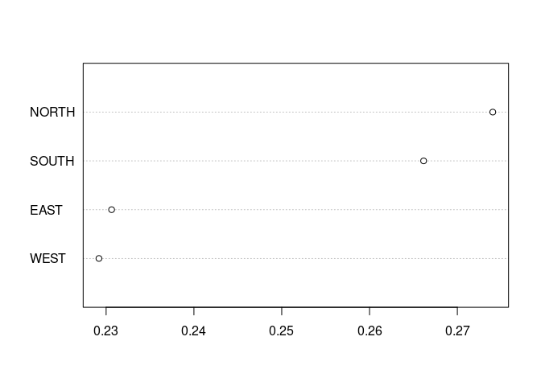
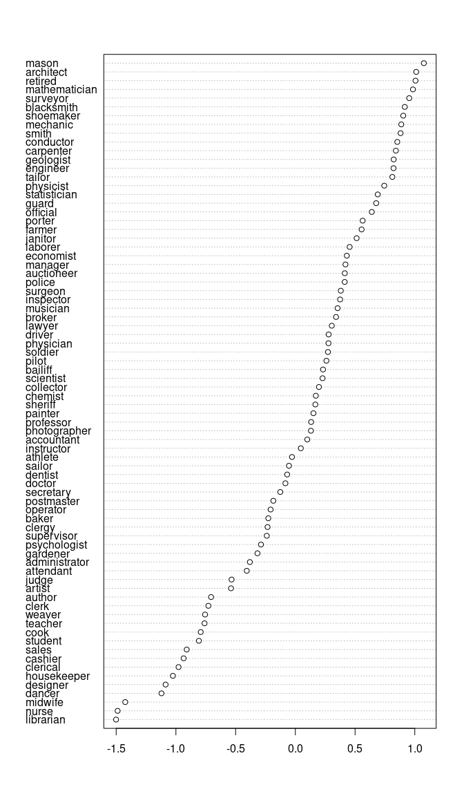

<!-- README.md is generated from README.Rmd. Please edit that file -->

# sweater 

<!-- badges: start -->

[](https://github.com/chainsawriot/sweater/actions)
[](https://app.codecov.io/gh/chainsawriot/sweater?branch=master)
[](https://CRAN.R-project.org/package=sweater)
<!-- badges: end -->

The goal of sweater (**S**peedy **W**ord **E**mbedding **A**ssociation
**T**est & **E**xtras using **R**) is to test for associations among
words in word embedding spaces. The methods provided by this package can
also be used to test for unwanted associations, or biases.

The package provides functions that are speedy. They are either
implemented in C++, or are speedy but accurate approximation of the
original implementation proposed by Caliskan et al (2017). See the
benchmark
[here](https://github.com/chainsawriot/sweater/blob/master/paper/benchmark.md).

This package provides extra methods such as Relative Norm Distance,
Embedding Coherence Test, SemAxis and Relative Negative Sentiment Bias.

If your goal is to reproduce the analysis in Caliskan et al (2017),
please consider using the [original Java
program](https://dataverse.harvard.edu/dataset.xhtml?persistentId=doi:10.7910/DVN/DX4VWP&version=2.0)
or the R package [cbn](https://github.com/conjugateprior/cbn) by Lowe.
To reproduce the analysis in Garg et al (2018), please consider using
the [original Python
program](https://github.com/nikhgarg/EmbeddingDynamicStereotypes). To
reproduce the analysis in Mazini et al (2019), please consider using the
[original Python
program](https://github.com/TManzini/DebiasMulticlassWordEmbedding/).

## Installation

Recommended: install the latest development version

``` r
remotes::install_github("chainsawriot/sweater")
```

or the “stable” release

``` r
install.packages("sweater")
```

## Notation of a query

All tests in this package use the concept of queries (see Badilla et
al., 2020) to study associations in the input word embeddings `w`. This
package uses the “STAB” notation from Brunet et al (2019). \[1\]

All tests depend on two types of words. The first type, namely,
`S_words` and `T_words`, is *target words* (or *neutral words* in Garg
et al). In the case of studying biases, these are words that **should**
have no bias. For instance, the words such as “nurse” and “professor”
can be used as target words to study the gender bias in word embeddings.
One can also separate these words into two sets, `S_words` and
`T_words`, to group words by their perceived bias. For example, Caliskan
et al. (2017) grouped target words into two groups: mathematics (“math”,
“algebra”, “geometry”, “calculus”, “equations”, “computation”,
“numbers”, “addition”) and arts (“poetry”, “art”, “dance”,
“literature”, “novel”, “symphony”, “drama”, “sculpture”). Please note
that also `T_words` is not always required.

The second type, namely `A_words` and `B_words`, is *attribute words*
(or *group words* in Garg et al). These are words with known properties
in relation to the bias that one is studying. For example, Caliskan et
al. (2017) used gender-related words such as “male”, “man”, “boy”,
“brother”, “he”, “him”, “his”, “son” to study gender bias. These words
qualify as attribute words because we know they are related to a certain
gender.

It is recommended to use the function `query()` to make a query and
`calculate_es()` to calculate the effect size.

## Available methods

| Target words       | Attribute words    | Method                                                      | `method` argument | Suggested by `query`? | legacy functions \[2\]                                |
| ------------------ | ------------------ | ----------------------------------------------------------- | ----------------- | --------------------- | ----------------------------------------------------- |
| S\_words           | A\_words           | Mean Average Cosine Similarity (Mazini et al. 2019)         | “mac”             | yes                   | mac(), mac\_es()                                      |
| S\_words           | A\_words, B\_words | Relative Norm Distance (Garg et al. 2018)                   | “rnd”             | yes                   | rnd(), rnd\_es()                                      |
| S\_words           | A\_words, B\_words | Relative Negative Sentiment Bias (Sweeney & Najafian. 2019) | “rnsb”            | no                    | rnsb(), rnsb\_es()                                    |
| S\_words           | A\_words, B\_words | Embedding Coherence Test (Dev & Phillips. 2019)             | “ect”             | no                    | ect(), ect\_es(), plot\_ect()                         |
| S\_words           | A\_words, B\_words | SemAxis (An et al. 2018)                                    | “semaxis”         | no                    | semaxis()                                             |
| S\_words           | A\_words, B\_words | Normalized Association Score (Caliskan et al. 2017)         | “nas”             | no                    | nas()                                                 |
| S\_words, T\_words | A\_words, B\_words | Word Embedding Association Test (Caliskan et al. 2017)      | “weat”            | yes                   | weat(), weat\_es(), weat\_resampling(), weat\_exact() |
| S\_words, T\_words | A\_words, B\_words | Word Embeddings Fairness Evaluation (Badilla et al. 2020)   | To be implemented |                       |                                                       |

## Example: Mean Average Cosine Similarity

The simplest form of bias detection is Mean Average Cosine Similarity
(Mazini et al. 2019). The same method is used also in Kroon et
al. (2020). `googlenews` is a subset of [the pretrained word2vec word
embeddings provided by
Google](https://code.google.com/archive/p/word2vec/).

By default, the `query()` function guesses the method you want to use
based on the combination of target words and attribute words provided
(see the “Suggested?” column in the above table). You can also make this
explicit by specifying the `method` argument. Printing the returned
object shows the effect size (if available) as well as the functions
that can further process the object: `calculate_es` and `plot`. Please
read the help file of `calculate_es` (`?calculate_es`) on what is the
meaning of the effect size for a specific test.

``` r
require(sweater)
```

``` r
S1 <- c("janitor", "statistician", "midwife", "bailiff", "auctioneer", 
"photographer", "geologist", "shoemaker", "athlete", "cashier", 
"dancer", "housekeeper", "accountant", "physicist", "gardener", 
"dentist", "weaver", "blacksmith", "psychologist", "supervisor", 
"mathematician", "surveyor", "tailor", "designer", "economist", 
"mechanic", "laborer", "postmaster", "broker", "chemist", "librarian", 
"attendant", "clerical", "musician", "porter", "scientist", "carpenter", 
"sailor", "instructor", "sheriff", "pilot", "inspector", "mason", 
"baker", "administrator", "architect", "collector", "operator", 
"surgeon", "driver", "painter", "conductor", "nurse", "cook", 
"engineer", "retired", "sales", "lawyer", "clergy", "physician", 
"farmer", "clerk", "manager", "guard", "artist", "smith", "official", 
"police", "doctor", "professor", "student", "judge", "teacher", 
"author", "secretary", "soldier")

A1 <- c("he", "son", "his", "him", "father", "man", "boy", "himself", 
"male", "brother", "sons", "fathers", "men", "boys", "males", 
"brothers", "uncle", "uncles", "nephew", "nephews")

## The same as:
## mac_neg <- query(googlenews, S_words = S1, A_words = A1, method = "mac")
mac_neg <- query(googlenews, S_words = S1, A_words = A1)
mac_neg
#> 
#> ── sweater object ──────────────────────────────────────────────────────────────────────────────────────────────────────────────────────────────────────────
#> Test type:  mac 
#> Effect size:  0.1375856
#> 
#> ── Functions ───────────────────────────────────────────────────────────────────────────────────────────────────────────────────────────────────────────────
#> • `calculate_es()`: Calculate effect size
#> • `plot()`: Plot the bias of each individual word
```

The returned object is an S3 object. Please refer to the help file of
the method for the definition of all slots (in this case: `?mac`). For
example, the magnitude of bias for each word in `S1` is available in the
`P` slot.

``` r
sort(mac_neg$P)
#>         sales      designer     economist       manager      clerical 
#>  -0.002892495   0.039197285   0.046155954   0.047322071   0.048912403 
#>      operator administrator        author    auctioneer        tailor 
#>   0.050275206   0.050319552   0.051470909   0.065440629   0.074771460 
#>     secretary     librarian     scientist  statistician         pilot 
#>   0.077506781   0.079040760   0.082535536   0.088000351   0.088337791 
#>     geologist      official     architect        broker     professor 
#>   0.088567238   0.090706054   0.091598653   0.098761198   0.101847166 
#>      engineer     collector         smith       chemist      surveyor 
#>   0.103448025   0.104596505   0.104956871   0.110798023   0.112098241 
#>     inspector        weaver     physicist       midwife    supervisor 
#>   0.112383017   0.113221694   0.114302092   0.115791724   0.118784135 
#>     physician        artist     conductor        clergy         guard 
#>   0.118990813   0.119571390   0.120602413   0.123313906   0.128804364 
#>    accountant    instructor         judge    postmaster         nurse 
#>   0.131700192   0.133135210   0.135238197   0.138497652   0.143781092 
#>          cook     attendant       sheriff        dancer  photographer 
#>   0.145019382   0.149134946   0.149992633   0.150637430   0.151388282 
#>  psychologist       cashier       surgeon mathematician       retired 
#>   0.151908676   0.153591372   0.158348402   0.158969004   0.165010593 
#>         clerk       student        porter      gardener       dentist 
#>   0.165903226   0.167006052   0.172551327   0.173346664   0.174776368 
#>       teacher       athlete       bailiff       painter        driver 
#>   0.175027901   0.176353551   0.176440157   0.176625091   0.181269327 
#>         baker     shoemaker        lawyer    blacksmith        farmer 
#>   0.183320490   0.183548112   0.189963886   0.198764788   0.199243319 
#>         mason        police   housekeeper        sailor      musician 
#>   0.203577329   0.206264491   0.208280255   0.208689761   0.219184802 
#>       janitor      mechanic        doctor       soldier       laborer 
#>   0.220953800   0.224008333   0.226657160   0.238053858   0.251032714 
#>     carpenter 
#>   0.259775292
```

## Example: Relative Norm Distance

This analysis reproduces the analysis in Garg et al (2018), namely
Figure 1.

``` r
B1 <- c("she", "daughter", "hers", "her", "mother", "woman", "girl", 
"herself", "female", "sister", "daughters", "mothers", "women", 
"girls", "females", "sisters", "aunt", "aunts", "niece", "nieces"
)

garg_f1 <- query(googlenews, S_words = S1, A_words = A1, B_words = B1)
garg_f1
#> 
#> ── sweater object ──────────────────────────────────────────────────────────────────────────────────────────────────────────────────────────────────────────
#> Test type:  rnd 
#> Effect size:  -6.341598
#> 
#> ── Functions ───────────────────────────────────────────────────────────────────────────────────────────────────────────────────────────────────────────────
#> • `calculate_es()`: Calculate effect size
#> • `plot()`: Plot the bias of each individual word
```

The object can be plotted by the function `plot` to show the bias of
each word in S. Words such as “nurse”, “midwife” and “librarian” are
more associated with female, as indicated by the positive relative norm
distance.

``` r
plot(garg_f1)
```



The effect size is simply the sum of all relative norm distance values
(Equation 3 in Garg et al. 2018). It is displayed simply by printing the
object. You can also use the function `calculate_es` to obtain the
numeric result.

The more positive effect size indicates that words in `S_words` are more
associated with `B_words`. As the effect size is negative, it indicates
that the concept of occupation is more associated with `A_words`,
i.e. male.

``` r
calculate_es(garg_f1)
#> [1] -6.341598
```

## Example: SemAxis

This analysis attempts to reproduce the analysis in An et al. (2018).

You may obtain the word2vec word vectors trained with Trump supporters
Reddit from [here](https://github.com/ghdi6758/SemAxis). This package
provides a tiny version of the data `small_reddit` for reproducing the
analysis.

``` r
S2 <- c("mexicans", "asians", "whites", "blacks", "latinos")
A2 <- c("respect")
B2 <- c("disrespect")
res <- query(small_reddit, S_words = S2, A_words = A2, B_words = B2, method = "semaxis", l = 1)
plot(res)
```



## Example: Embedding Coherence Test

Embedding Coherence Test (Dev & Phillips, 2019) is similar to SemAxis.
The only significant different is that no “SemAxis” is calculated (the
difference between the average word vectors of `A_words` and `B_words`).
Instead, it calculates two separate axes for `A_words` and `B_words`.
Then it calculates the proximity of each word in `S_words` with the two
axes. It is like doing two separate `mac`, but `ect` averages the word
vectors of `A_words` / `B_words` first.

It is important to note that `P` is a 2-D matrix. Hence, the plot is
2-dimensional. Words above the equality line are more associated with
`B_words` and vice versa.

``` r
res <- query(googlenews, S_words = S1, A_words = A1, B_words = B1, method = "ect")
res$P
#>           janitor statistician   midwife   bailiff auctioneer photographer
#> A_words 0.3352883   0.13495237 0.1791162 0.2698131 0.10123085    0.2305419
#> B_words 0.2598501   0.08300127 0.3851766 0.2331852 0.06957685    0.2077952
#>          geologist shoemaker   athlete   cashier    dancer housekeeper
#> A_words 0.13817054 0.2842002 0.2607956 0.2340296 0.2282981   0.3205498
#> B_words 0.05101061 0.1850456 0.2570477 0.3171645 0.3508183   0.4610773
#>         accountant  physicist  gardener   dentist    weaver blacksmith
#> A_words  0.2029543 0.17446868 0.2657907 0.2672548 0.1767915  0.3080301
#> B_words  0.1789482 0.08362829 0.2873140 0.2623802 0.2475565  0.1603038
#>         psychologist supervisor mathematician   surveyor     tailor   designer
#> A_words    0.2322444  0.1852041     0.2423898 0.17124643 0.11379186 0.06231389
#> B_words    0.2418605  0.1920407     0.1332954 0.09133125 0.07585015 0.14343468
#>          economist  mechanic   laborer postmaster    broker   chemist librarian
#> A_words 0.07450962 0.3435494 0.3904412  0.2128712 0.1525395 0.1696522 0.1237070
#> B_words 0.04008006 0.1882135 0.3011930  0.2223472 0.1112061 0.1440956 0.3147546
#>         attendant   clerical  musician    porter scientist carpenter    sailor
#> A_words 0.2278508 0.07601974 0.3349666 0.2642203 0.1263250 0.4006367 0.3169384
#> B_words 0.2495253 0.15137979 0.2735083 0.1957056 0.1023058 0.2425019 0.3083380
#>         instructor   sheriff     pilot inspector     mason     baker
#> A_words  0.2034101 0.2256034 0.1339011 0.1741268 0.3154815 0.2847909
#> B_words  0.1903228 0.2029597 0.1112940 0.1272682 0.1585883 0.2981460
#>         administrator    architect collector   operator   surgeon    driver
#> A_words    0.08028339 0.1397101748 0.1572854 0.07317863 0.2337787 0.2733306
#> B_words    0.10544115 0.0008324421 0.1341877 0.08706450 0.1926543 0.2363398
#>           painter conductor     nurse      cook   engineer   retired
#> A_words 0.2703030 0.1832604 0.2187359 0.2278016 0.16052771 0.2494770
#> B_words 0.2413599 0.1034218 0.4470728 0.2849471 0.03511008 0.1146753
#>                sales    lawyer    clergy physician    farmer     clerk
#> A_words -0.006505338 0.2937436 0.1920894 0.1777700 0.3090903 0.2519372
#> B_words  0.032652565 0.2345743 0.2081210 0.1555298 0.2220792 0.3146901
#>            manager     guard    artist      smith  official    police    doctor
#> A_words 0.07080773 0.1948853 0.1819504 0.15938222 0.1300515 0.3116599 0.3413265
#> B_words 0.03393879 0.1344678 0.2274278 0.09691327 0.0743546 0.2590763 0.3390124
#>         professor   student     judge   teacher    author secretary   soldier
#> A_words 0.1604224 0.2540493 0.2008630 0.2675705 0.0828586 0.1211243 0.3599860
#> B_words 0.1368013 0.3299938 0.2493299 0.3567416 0.1224295 0.1220939 0.3076572
plot(res)
```



Effect size can also be calculated. It is the Spearman Correlation
Coefficient of the two rows in `P`. Higher value indicates more
“coherent”, i.e. less bias.

``` r
res
#> 
#> ── sweater object ──────────────────────────────────────────────────────────────────────────────────────────────────────────────────────────────────────────
#> Test type:  ect 
#> Effect size:  0.7001504
#> 
#> ── Functions ───────────────────────────────────────────────────────────────────────────────────────────────────────────────────────────────────────────────
#> • `calculate_es()`: Calculate effect size
#> • `plot()`: Plot the bias of each individual word
```

## Example: Relative Negative Sentiment Bias

This analysis attempts to reproduce the analysis in Sweeney & Najafian
(2019).

Please note that the datasets `glove_sweeney`, `bing_pos` and `bing_neg`
are not included in the package. If you are interested in reproducing
the analysis, the 3 datasets are available from
[here](https://github.com/chainsawriot/sweater/tree/master/tests/testdata).

``` r
load("tests/testdata/bing_neg.rda")
load("tests/testdata/bing_pos.rda")
load("tests/testdata/glove_sweeney.rda")

S3 <- c("swedish", "irish", "mexican", "chinese", "filipino",
        "german", "english", "french", "norwegian", "american",
        "indian", "dutch", "russian", "scottish", "italian")
sn <- query(glove_sweeney, S_words = S3, A_words = bing_pos, B_words = bing_neg, method = "rnsb")
```

The analysis shows that `indian`, `mexican`, and `russian` are more
likely to be associated with negative sentiment.

``` r
plot(sn)
```



The effect size from the analysis is the Kullback–Leibler divergence of
P from the uniform distribution. It is extremely close to the value
reported in the original paper (0.6225).

``` r
sn
#> 
#> ── sweater object ──────────────────────────────────────────────────────────────────────────────────────────────────────────────────────────────────────────
#> Test type:  rnsb 
#> Effect size:  0.6228853
#> 
#> ── Functions ───────────────────────────────────────────────────────────────────────────────────────────────────────────────────────────────────────────────
#> • `calculate_es()`: Calculate effect size
#> • `plot()`: Plot the bias of each individual word
```

## Support for Quanteda Dictionaries

`rnsb` supports [quanteda](https://github.com/quanteda/quanteda)
dictionaries as `S_words`. This support will be expanded to other
methods later.

This analysis uses the data from
[here](https://github.com/chainsawriot/sweater/tree/master/tests/testdata).

For example, `newsmap_europe` is an abridged dictionary from the package
newsmap (Watanabe, 2018). The dictionary contains keywords of European
countries and has two levels: regional level (e.g. Eastern Europe) and
country level (e.g. Germany).

``` r
load("tests/testdata/newsmap_europe.rda")
load("tests/testdata/dictionary_demo.rda")

require(quanteda)
#> Loading required package: quanteda
#> Package version: 3.2.0
#> Unicode version: 13.0
#> ICU version: 66.1
#> Parallel computing: 8 of 8 threads used.
#> See https://quanteda.io for tutorials and examples.
newsmap_europe
#> Dictionary object with 4 primary key entries and 2 nested levels.
#> - [EAST]:
#>   - [BG]:
#>     - bulgaria, bulgarian*, sofia
#>   - [BY]:
#>     - belarus, belarusian*, minsk
#>   - [CZ]:
#>     - czech republic, czech*, prague
#>   - [HU]:
#>     - hungary, hungarian*, budapest
#>   - [MD]:
#>     - moldova, moldovan*, chisinau
#>   - [PL]:
#>     - poland, polish, pole*, warsaw
#>   [ reached max_nkey ... 4 more keys ]
#> - [NORTH]:
#>   - [AX]:
#>     - aland islands, aland island*, alandish, mariehamn
#>   - [DK]:
#>     - denmark, danish, dane*, copenhagen
#>   - [EE]:
#>     - estonia, estonian*, tallinn
#>   - [FI]:
#>     - finland, finnish, finn*, helsinki
#>   - [FO]:
#>     - faeroe islands, faeroe island*, faroese*, torshavn
#>   - [GB]:
#>     - uk, united kingdom, britain, british, briton*, brit*, london
#>   [ reached max_nkey ... 10 more keys ]
#> - [SOUTH]:
#>   - [AD]:
#>     - andorra, andorran*
#>   - [AL]:
#>     - albania, albanian*, tirana
#>   - [BA]:
#>     - bosnia, bosnian*, bosnia and herzegovina, herzegovina, sarajevo
#>   - [ES]:
#>     - spain, spanish, spaniard*, madrid, barcelona
#>   - [GI]:
#>     - gibraltar, gibraltarian*, llanitos
#>   - [GR]:
#>     - greece, greek*, athens
#>   [ reached max_nkey ... 11 more keys ]
#> - [WEST]:
#>   - [AT]:
#>     - austria, austrian*, vienna
#>   - [BE]:
#>     - belgium, belgian*, brussels
#>   - [CH]:
#>     - switzerland, swiss*, zurich, bern
#>   - [DE]:
#>     - germany, german*, berlin, frankfurt
#>   - [FR]:
#>     - france, french*, paris
#>   - [LI]:
#>     - liechtenstein, liechtenstein*, vaduz
#>   [ reached max_nkey ... 3 more keys ]
```

Country-level analysis

``` r
country_level <- rnsb(w = dictionary_demo, S_words = newsmap_europe, A_words = bing_pos, B_words = bing_neg, levels = 2)
plot(country_level)
```



Region-level analysis

``` r
region_level <- rnsb(w = dictionary_demo, S_words = newsmap_europe, A_words = bing_pos, B_words = bing_neg, levels = 1)
plot(region_level)
```



Comparison of the two effect sizes. Please note the much smaller effect
size from region-level analysis. It reflects the evener distribution of
P across regions than across countries.

``` r
calculate_es(country_level)
#> [1] 0.0796689
calculate_es(region_level)
#> [1] 0.00329434
```

## Example: Normalized Association Score

Normalized Association Score (Caliskan et al., 2017) is similar to
Relative Norm Distance above.

``` r
S3 <- c("janitor", "statistician", "midwife", "bailiff", "auctioneer", 
"photographer", "geologist", "shoemaker", "athlete", "cashier", 
"dancer", "housekeeper", "accountant", "physicist", "gardener", 
"dentist", "weaver", "blacksmith", "psychologist", "supervisor", 
"mathematician", "surveyor", "tailor", "designer", "economist", 
"mechanic", "laborer", "postmaster", "broker", "chemist", "librarian", 
"attendant", "clerical", "musician", "porter", "scientist", "carpenter", 
"sailor", "instructor", "sheriff", "pilot", "inspector", "mason", 
"baker", "administrator", "architect", "collector", "operator", 
"surgeon", "driver", "painter", "conductor", "nurse", "cook", 
"engineer", "retired", "sales", "lawyer", "clergy", "physician", 
"farmer", "clerk", "manager", "guard", "artist", "smith", "official", 
"police", "doctor", "professor", "student", "judge", "teacher", 
"author", "secretary", "soldier")
A3 <- c("he", "son", "his", "him", "father", "man", "boy", "himself", 
"male", "brother", "sons", "fathers", "men", "boys", "males", 
"brothers", "uncle", "uncles", "nephew", "nephews")
B3 <- c("she", "daughter", "hers", "her", "mother", "woman", "girl", 
"herself", "female", "sister", "daughters", "mothers", "women", 
"girls", "females", "sisters", "aunt", "aunts", "niece", "nieces"
)

nas_f1 <- query(googlenews, S_words= S3, A_words = A3, B_words = B3, method = "nas")
plot(nas_f1)
```



There is a very strong correlation between NAS and RND.

``` r
cor.test(nas_f1$P, garg_f1$P)
#> 
#>  Pearson's product-moment correlation
#> 
#> data:  nas_f1$P and garg_f1$P
#> t = -24.93, df = 74, p-value < 2.2e-16
#> alternative hypothesis: true correlation is not equal to 0
#> 95 percent confidence interval:
#>  -0.9650781 -0.9148179
#> sample estimates:
#>        cor 
#> -0.9453038
```

## Example: Word Embedding Association Test

This example reproduces the detection of “Math. vs Arts” gender bias in
Caliskan et al (2017).

``` r
data(glove_math) # a subset of the original GLoVE word vectors

S4 <- c("math", "algebra", "geometry", "calculus", "equations", "computation", "numbers", "addition")
T4 <- c("poetry", "art", "dance", "literature", "novel", "symphony", "drama", "sculpture")
A4 <- c("male", "man", "boy", "brother", "he", "him", "his", "son")
B4 <- c("female", "woman", "girl", "sister", "she", "her", "hers", "daughter")
sw <- query(glove_math, S4, T4, A4, B4)

# extraction of effect size
sw
#> 
#> ── sweater object ──────────────────────────────────────────────────────────────────────────────────────────────────────────────────────────────────────────
#> Test type:  weat 
#> Effect size:  1.055015
#> 
#> ── Functions ───────────────────────────────────────────────────────────────────────────────────────────────────────────────────────────────────────────────
#> • `calculate_es()`: Calculate effect size
#> • `weat_resampling()`: Conduct statistical test
```

## A note about the effect size

By default, the effect size from the function `weat_es` is adjusted by
the pooled standard deviaion (see Page 2 of Caliskan et al. 2007). The
standardized effect size can be interpreted the way as Cohen’s d (Cohen,
1988).

One can also get the unstandardized version (aka. test statistic in the
original paper):

``` r
## weat_es
calculate_es(sw, standardize = FALSE)
#> [1] 0.02486533
```

The original implementation assumes equal size of `S` and `T`. This
assumption can be relaxed by pooling the standard deviaion with sample
size adjustment. The function `weat_es` does it when `S` and `T` are of
different length.

Also, the effect size can be converted to point-biserial correlation
(mathematically equivalent to the Pearson’s product moment correlation).

``` r
weat_es(sw, r = TRUE)
#> [1] 0.4912066
```

## Exact test

The exact test described in Caliskan et al. (2017) is also available.
But it takes a long time to calculate.

``` r
## Don't do it. It takes a long time and is almost always significant.
weat_exact(sw)
```

Instead, please use the resampling approximation of the exact test. The
p-value is very close to the reported 0.018.

``` r
weat_resampling(sw)
#> 
#>  Resampling approximation of the exact test in Caliskan et al. (2017)
#> 
#> data:  sw
#> bias = 0.024865, p-value = 0.0171
#> alternative hypothesis: true bias is greater than 7.245425e-05
#> sample estimates:
#>       bias 
#> 0.02486533
```

## How to get help

  - Read the
    [documentation](https://rdrr.io/github/chainsawriot/sweater/man/)
  - Search for [issues](https://github.com/chainsawriot/sweater/issues)
  - If you have further questions about the package, please contact
    Chung-hong Chan by e-mail, post, or other methods listed on this
    [page](https://www.mzes.uni-mannheim.de/d7/en/profiles/chung-hong-chan).

## Contributing

Contributions in the form of feedback, comments, code, and bug report
are welcome.

  - Fork the source code, modify, and issue a [pull
    request](https://docs.github.com/en/github/collaborating-with-issues-and-pull-requests/creating-a-pull-request-from-a-fork).
  - Issues, bug reports: [File a Github
    issue](https://github.com/chainsawriot/sweater/issues).

## Code of Conduct

Please note that the sweater project is released with a [Contributor
Code of
Conduct](https://contributor-covenant.org/version/2/0/CODE_OF_CONDUCT.html).
By contributing to this project, you agree to abide by its terms.

## References

1.  An, J., Kwak, H., & Ahn, Y. Y. (2018). SemAxis: A lightweight
    framework to characterize domain-specific word semantics beyond
    sentiment. arXiv preprint arXiv:1806.05521.
2.  Badilla, P., Bravo-Marquez, F., & Pérez, J. (2020). WEFE: The word
    embeddings fairness evaluation framework. In Proceedings of the 29
    th Intern. Joint Conf. Artificial Intelligence.
3.  Brunet, M. E., Alkalay-Houlihan, C., Anderson, A., & Zemel, R.
    (2019, May). Understanding the origins of bias in word embeddings.
    In International Conference on Machine Learning (pp. 803-811). PMLR.
4.  Caliskan, Aylin, Joanna J. Bryson, and Arvind Narayanan. “Semantics
    derived automatically from language corpora contain human-like
    biases.” Science 356.6334 (2017): 183-186.
5.  Cohen, J. (1988), Statistical Power Analysis for the Behavioral
    Sciences, 2nd Edition. Hillsdale: Lawrence Erlbaum.
6.  Dev, S., & Phillips, J. (2019, April). Attenuating bias in word
    vectors. In The 22nd International Conference on Artificial
    Intelligence and Statistics (pp. 879-887). PMLR.
7.  Garg, N., Schiebinger, L., Jurafsky, D., & Zou, J. (2018). Word
    embeddings quantify 100 years of gender and ethnic stereotypes.
    Proceedings of the National Academy of Sciences, 115(16),
    E3635-E3644.
8.  Manzini, T., Lim, Y. C., Tsvetkov, Y., & Black, A. W. (2019). Black
    is to criminal as caucasian is to police: Detecting and removing
    multiclass bias in word embeddings. arXiv preprint arXiv:1904.04047.
9.  McGrath, R. E., & Meyer, G. J. (2006). When effect sizes disagree:
    the case of r and d. Psychological methods, 11(4), 386.
10. Rosenthal, R. (1991), Meta-Analytic Procedures for Social Research.
    Newbury Park: Sage
11. Sweeney, C., & Najafian, M. (2019, July). A transparent framework
    for evaluating unintended demographic bias in word embeddings. In
    Proceedings of the 57th Annual Meeting of the Association for
    Computational Linguistics (pp. 1662-1667).
12. Watanabe, K. (2018). Newsmap: A semi-supervised approach to
    geographical news classification. Digital Journalism, 6(3), 294-309.

-----

1.  In the pre 0.1.0 version of this package, the package used `S`, `T`,
    `A`, and `B` as the main parameters. It was later rejected because
    the symbol `T` is hardlinked to the logical value `TRUE` [as a
    global
    variable](https://stat.ethz.ch/R-manual/R-devel/library/base/html/logical.html);
    and it is considered to be a [bad
    style](https://style.tidyverse.org/syntax.html) to use the symbol
    `T`. Accordingly, they were renamed to `S_words`, `T_words`,
    `A_words`, and `B_words` respectively. But in general, please stop
    using the symbol `T` to represent `TRUE`\!

2.  Please use the `query` function. These functions are kept for
    backward compatibility.
