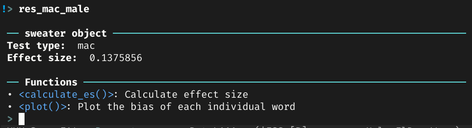

```{r setup, include = FALSE}
library("papaja")
```

```{r analysis-preferences}
# Seed for random number generation
set.seed(42)
knitr::opts_chunk$set(cache.extra = knitr::rand_seed)
library(sweater)
```

# Statement of need

The goal of the R package `sweater` is to detect (implicit) biases in word embeddings. The importance of detecting biases in word embeddings is twofold. First, pretrained, biased word embeddings deployed in real-life machine learning systems can pose fairness concerns [@packer2018text;@boyarskaya2020overcoming]. Second, biases in word embeddings reflect the biases in the original training material. Social scientists, communication researchers included, have exploited these methods to quantify (implicit) media biases by extracting biases from word embeddings locally trained on large text corpora [e.g. @kroon2020guilty;@knoche2019identifying;@sales2019media]. Biases in word embedding can be understood through the implicit social cognition model of media priming [@arendt:2013:DDM]. In this model, implicit stereotypes are defined as the "strength of the automatic association between a group concept (e.g., minority group) and an attribute (e.g., criminal)." [@arendt:2013:DDM, p. 832] All of these bias detection methods are based on the strength of association between a concept (or a target) and an attribute in embedding spaces.

Previously, the software of these methods is only scatteredly available as the addendum of the original papers and was implemented in different languages (Java, Python, etc.). `sweater` provides several of these bias detection methods in one unified package with a consistent R interface [@rcore]. Also, some provided methods in `sweater` are implemented in C++ and interfaced to R using the Rcpp package [@eddelbuettel:2013:SRC]. These heavily optimized methods, such as the Word Embedding Association Test (WEAT) [@caliskan:2017:S], are significantly faster than the same methods implemented in interpreted languages.

In the usage section below, we demonstrated how the package can be used to detect biases and reproduce some published findings.

# Usage

## Word Embeddings

The input word embedding $w$ is a dense $m\times n$ matrix, where $m$ is the total size of the vocabulary in the training corpus and $n$ is the vector dimension size. Let $v_x$ denote a row vector of $w$, the word vector of the word $x$.

`sweater` supports two types of $w$. For locally trained word embeddings, word embedding outputs from the R packages *word2vec* [@wijffelsword2vec], *rsparse* [@rsparse] and *text2vec* [@selivanov2020tex2vec] are directly supported [^TRAIN]. For pretrained word embeddings obtained online [^SOURCE], they are usually provided in the so-called "word2vec" file format and `sweater`'s function `read_word2vec` reads those files into the supported matrix format.

[^TRAIN]: The vignette of *text2vec* provides a guide on how to locally train word embeddings using the GLoVE algorithm [@pennington:2014:G] on a large corpus from R. https://cran.r-project.org/web/packages/text2vec/vignettes/glove.html

[^SOURCE]: For example, the pretrained GLoVE word embeddings provided in https://nlp.stanford.edu/projects/glove/, pretrained word2vec word embeddings provided in https://wikipedia2vec.github.io/wikipedia2vec/pretrained/  and fastText word embeddings provided in https://fasttext.cc/docs/en/english-vectors.html.

## Query

`sweater` uses the concept of *query* [@badilla2020wefe] to study the biases in $w$. A query contains two or more sets of seed words with at least one set of *target words* and one set of *attribute words*. `sweater` uses the $\mathcal{S}\mathcal{T}\mathcal{A}\mathcal{B}$ notation from @brunet2019understanding to form a query.

Target words are words that **should** have no bias. They are denoted as wordsets $\mathcal{S}$ and $\mathcal{T}$. All methods require $\mathcal{S}$ while $\mathcal{T}$ is only required for WEAT. For instance, the study of gender stereotypes in academic pursuits by @caliskan:2017:S used $\mathcal{S} = \{math, algebra, geometry, calculus, equations, computation, numbers, addition\}$ and $\mathcal{T}= \{poetry, art, dance, literature, novel, symphony, drama, sculpture\}$.

Attribute words are words that have known properties in relation to the bias. They are denoted as wordsets $\mathcal{A}$ and $\mathcal{B}$. All methods require both wordsets except Mean Average Cosine Similarity [@manzini2019black]. For instance, the study of gender stereotypes by @caliskan:2017:S used $\mathcal{A} = \{he, son, his, him, father, man, boy, himself, male, ...\}$ and $\mathcal{B} = \{she, daughter, hers, her, mother, woman, girl, herself, female, ...\}$. In some applications, popular off-the-shelf sentiment dictionaries can also be used as $\mathcal{A}$ and $\mathcal{B}$ [e.g. @sweeney2020reducing]. That being said, it is up to the researchers to select and derive these seed words in a query. However, the selection of seed words has been shown to be the most consequential part of the entire analysis [@antoniak2021bad;@du2021assessing]. Please read @antoniak2021bad for recommendations.

## Supported methods

Table \@ref(tab:t1) lists all methods supported by `sweater`. As Relative Norm Distance, SemAxis, Normalized Association Score, and Embedding Coherence Test are all distance-based measures, only Relative Norm Distance is demonstrated below.

Table: (\#tab:t1) All methods supported by `sweater`

| Method                                                  | Target words                 | Attribute words              | shorthand |
|---------------------------------------------------------|------------------------------|------------------------------|-----------|
| Mean Average Cosine Similarity [@manzini2019black]      | $\mathcal{S}$                | $\mathcal{A}$                | `mac`     |
| Relative Norm Distance [@garg:2018:W]                   | $\mathcal{S}$                | $\mathcal{A}$, $\mathcal{B}$ | `rnd`     |
| SemAxis [@an2018semaxis]                                | $\mathcal{S}$                | $\mathcal{A}$, $\mathcal{B}$ | `semaxis` |
| Normalized Association Score [@caliskan:2017:S]         | $\mathcal{S}$                | $\mathcal{A}$, $\mathcal{B}$ | `nas`     |
| Embedding Coherence Test [@dev2019attenuating]          | $\mathcal{S}$                | $\mathcal{A}$, $\mathcal{B}$ | `ect`     |
| Relative Negative Sentiment Bias [@sweeney2020reducing] | $\mathcal{S}$                | $\mathcal{A}$, $\mathcal{B}$ | `rnsb`    |
| Word Embedding Association Test [@caliskan:2017:S]      | $\mathcal{S}$, $\mathcal{T}$ | $\mathcal{A}$, $\mathcal{B}$ | `weat`    |

# Examples

In the following examples, the publicly available word2vec word embeddings trained on the Google News corpus is used [@mikolov2013distributed]. `sweater` provides a unified interface for making query, calculating effect size, and plotting result. Three functions are used:

* `query` for making query. It follows a template of `method(w, S_words, T_words, A_words, B_words, method)` for a query. 
* `calculate_es` for calcuting effect size which represents the overall bias of $w$ based on the query
* `plot` for visualizing the result of a query

The argument `method` of the function `query` determines which method to use (see Table \@ref(tab:t1) for the list of shorthands). By default, it is set to "guess", i.e. the function select the appropriate method for you based on your provided $\mathcal{S}$, $\mathcal{T}$, $\mathcal{A}$, and $\mathcal{B}$.

## Mean Average Cosine Similarity

Average cosine similarity [@manzini2019black] is calculated as the mean cosine similarity between the word vector of a target word $v_s$ where $s \in \mathcal{S}$ and that of all terms in the attribute wordset ${\mathcal{A}}$. The same method was deployed in @kroon2020guilty.

The average cosine similarity of many occupation words in $\mathcal{S}$ are calculated against a wordset $\mathcal{A}$ of attribute words related to male. 

The code below shows how to conduct a query using the `query` function. When only $\mathcal{S}$ and $\mathcal{A}$ are provided, the function assumes that the query calls for calcuting average cosine similarity. The function returns an S3 object.

```{r, echo = FALSE}
S <- c("janitor", "statistician", "midwife", "bailiff", "auctioneer",
       "photographer", "geologist", "shoemaker", "athlete", "cashier",
       "dancer", "housekeeper", "accountant", "physicist", "gardener",
       "dentist", "weaver", "blacksmith", "psychologist", "supervisor",
       "mathematician", "surveyor", "tailor", "designer", "economist",
       "mechanic", "laborer", "postmaster", "broker", "chemist", "librarian",
       "attendant", "clerical", "musician", "porter", "scientist",
       "carpenter", "sailor", "instructor", "sheriff", "pilot", "inspector",
       "mason", "baker", "administrator", "architect", "collector",
       "operator", "surgeon", "driver", "painter", "conductor", "nurse",
       "cook", "engineer", "retired", "sales", "lawyer", "clergy",
       "physician", "farmer", "clerk", "manager", "guard", "artist", "smith",
       "official", "police", "doctor", "professor", "student", "judge",
       "teacher", "author", "secretary", "soldier")
A <- c("he", "son", "his", "him", "father", "man", "boy", "himself", "male",
       "brother", "sons", "fathers", "men", "boys", "males", "brothers",
       "uncle", "uncles", "nephew", "nephews")
res_mac_male <- query(w = googlenews, S_words= S, A_words = A)
```

In an interactive session, printing the S3 object shows the effect size and other functions (or more accurately, S3 methods) that can further process the object (Figure \@ref(fig:interactive)).

```{r interactive, echo = FALSE, fig.cap = "The printed S3 object produced with `query` in an R interactive session", fig.width = 8}

```

For most of the functions, the returned S3 object contains a slot `P`, which stores the bias of each word (e.g. `res_mac_male$P`). The average cosine similarity values are `P` in this case. The function `plot` can be used to visualize `P` as a Cleveland Dot Plot (Figure \@ref(fig:acs)).

```{r acs, echo = TRUE, fig.height = 11, fig.cap = "Bias of words in the target wordset according to average cosine similarity"}
plot(res_mac_male)
```

The effect size, mean average cosine similarity, is the mean value of all average cosine similarity values.

```{r, echo = TRUE}
calculate_es(res_mac_male)
```

## Relative Norm Distance

Relative norm distance (RND) [@garg:2018:W] is calculated with two sets of attribute words. The following analysis reproduces the calculation of "women bias" values in @garg:2018:W. Compared with average cosine similarity, RND appears to be reflecting the underlying gender bias more accurately (Figure \@ref(fig:rnd)).

```{r rnd, echo = TRUE, fig.height = 11, fig.cap = "Bias of words in the target wordset according to relative norm distance"}
B <- c("she", "daughter", "hers", "her", "mother", "woman", "girl",
       "herself", "female", "sister", "daughters", "mothers", "women",
       "girls", "females", "sisters", "aunt", "aunts", "niece", "nieces")
res_rnd_male <- query(w = googlenews, S_words = S, A_words= A, B_words = B)
plot(res_rnd_male)
```

The effect size is the sum of all `P`. As the effect size is negative, it indicates that the concept of occupation is more associated with $\mathcal{A}$, i.e. male.

```{r, echo = TRUE}
calculate_es(res_rnd_male)
```

<!-- ## SemAxis -->

<!-- SemAxis [@an2018semaxis] is computationally very similar to RND. The unique feature of SemAxis is the augmentation of the two attribute wordsets by adding more related words based on cosine similarity. `sweater` also provides this augmentation and it can be controlled by the parameter `l`. In the following example, `l` is set to the default value of 0, i.e. no augmentation. The result is extremely similar to RND, albeit flipped (Figure \@ref(fig:semaxis)). -->

<!-- ```{r semaxis, echo = TRUE, fig.height = 11, fig.cap = "Bias of words in the target wordset according to SemAxis"} -->
<!-- res_semaxis_male <- query(w = googlenews, S_words = S, A_words = A, B_words= B, method = "semaxis") -->
<!-- plot(res_semaxis_male) -->
<!-- ``` -->

<!-- ## Normalized Association Score -->

<!-- Normalized association score (NAS) [@caliskan:2017:S] is also very similar to RND. The major difference is that this method is computationally more intensive than both RND and SemAxis (Figure \@ref(fig:nas)). -->

<!-- ```{r nas, echo = TRUE, fig.height = 11, fig.cap = "Bias of words in the target wordset according to normalized association score"} -->
<!-- res_nas_male <- query(w = googlenews, S_words = S, A_words = A, B_words = B, method = "nas") -->
<!-- plot(res_nas_male) -->
<!-- ``` -->

## Relative Negative Sentiment Bias

Relative negative sentiment bias (RNSB) [@sweeney2020reducing] takes the same query template as RND. But the technique is not based on a distance metric such as cosine similarity. Instead, the method trained a regularized logistic regression model on the word vectors $v_{x \in \mathcal{A} \bigcup \mathcal{B}}$ to predict the probability of $x$ being in $\mathcal{B}$. The bias is quantified as the relative probability of the word $s$ for being a word in the wordset $\mathcal{B}$ (Figure \@ref(fig:rnsb)).

```{r rnsb, echo = TRUE, fig.height = 11, fig.cap = "Bias of words in the target wordset according to relative negative sentiment bias"}
res_rnsb_male <- query(w = googlenews, S_words = S, A_words = A,
                       B_words = B, method = "rnsb")
plot(res_rnsb_male)
```

The effect size in this case is the Kullback–Leibler divergence of P from the uniform distribution. 

```{r, echo = TRUE}
calculate_es(res_rnsb_male)
```

## Word Embedding Association Test

Word Embedding Association Test (WEAT) [@caliskan:2017:S] requires all four wordsets of $\mathcal{S}$, $\mathcal{T}$, $\mathcal{A}$, and $\mathcal{B}$. The method is modeled after the Implicit Association Test (IAT) [@nosek:2005:UUI] and it measures the relative strength of $\mathcal{S}$'s association with $\mathcal{A}$ to $\mathcal{B}$ against the same of $\mathcal{T}$. The effect sizes calculated from a large corpus, as shown by @caliskan:2017:S, are comparable to the published IAT effect sizes obtained from volunteers.

In this example, a different $w$ is used. It is the publicly available GLoVE embeddings made available by the original Stanford Team [@pennington:2014:G]. The same GLoVE embeddings were used in @caliskan:2017:S. In the following example, the calculation of "Math. vs Arts" gender bias is reproduced. Please note that for WEAT, the returned object does not contain `P`. By default, the effect size is standardized so that it can be interpreted the same way as Cohen's D [@cohen2013statistical].

```{r, echo = TRUE}
data(glove_math) # a subset of the original GLoVE word vectors
S <- c("math", "algebra", "geometry", "calculus", "equations", "computation",
       "numbers", "addition")
T <- c("poetry", "art", "dance", "literature", "novel", "symphony", "drama",
       "sculpture")
A <- c("male", "man", "boy", "brother", "he", "him", "his", "son")
B <- c("female", "woman", "girl", "sister", "she", "her", "hers", "daughter")
sw <- query(glove_math, S, T, A, B)
sw
```

The effect size can also be converted to point-biserial correlation coefficient.

```{r, echo = TRUE}
calculate_es(sw, r = TRUE)
```

One can also obtain the unstandardized effect size. In the original paper [@caliskan:2017:S], it is referred to as "test statistic".

```{r, echo = TRUE}
calculate_es(sw, standardize = FALSE)
```

One can also test the statistical significance of the effect size. The original paper suggests an exact test [@caliskan:2017:S]. This exact test is implemented in this package as the function `weat_exact`. But the exact test takes a long time to calculate when the number of words in $\mathcal{S}$ is larger than a few words.

Instead, we recommend the resampling approximation of the exact test. The p-value is extremely close to the reported 0.018.

```{r, echo = TRUE}
weat_resampling(sw)
```

# Conclusion

This paper demonstrates how `sweater` can be used to detect biases in word embeddings.

\newpage

# References

\begingroup
\setlength{\parindent}{-0.5in}
\setlength{\leftskip}{0.5in}

<div id="refs" custom-style="Bibliography"></div>
\endgroup
