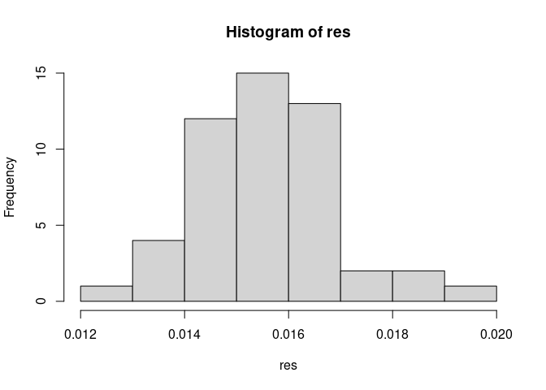
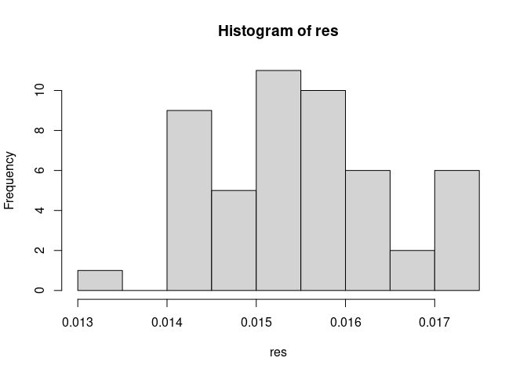
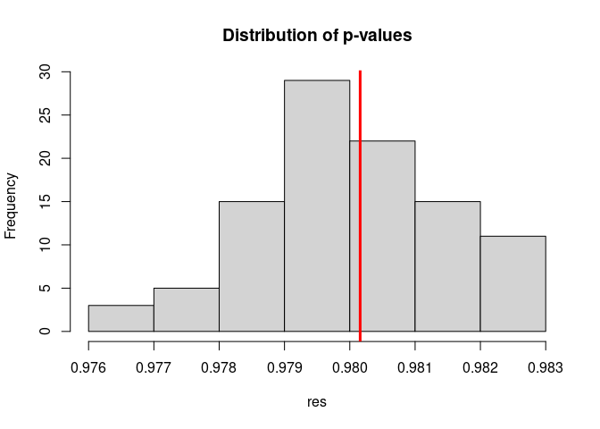

The original significance test proposed by Caliskan et al. in their
paper is based on exact inference using a permutaion approach. This
package provides such an exact test. But like any permutation test (such
as Fisher’s exact test), the number of permuations, as well as the
running time, grows *factorially* — O(n\!) — with the number of samples
(in the case, the total length of S and T). In the “math vs poetry”
example used extensively in this package, the total length of S and T is
16. The total number of iterations needed is 16\! = 20922789888000. The
number grows 306x to 18\! = 6402373705728000 by just adding one item
each to S and T. It is unrealistic to expect an ordinary computer can do
such computation within a reasonable time frame.

In the following benchmark, we studied how much time does it take to
finish an exact test with the word set with a length of 2 to 4. I
actually don’t recommend trying anything beyond 6; it would take
probably a few hours, days even. And actually, the function `weat_exact`
will warn you about that.

``` r
library(sweater)
S1 <- c("math", "algebra", "geometry", "calculus", "equations",
 "computation", "numbers", "addition")
T1 <- c("poetry", "art", "dance", "literature", "novel", "symphony", "drama", "sculpture")
A1 <- c("male", "man", "boy", "brother", "he", "him", "his", "son")
B1 <- c("female", "woman", "girl", "sister", "she", "her", "hers", "daughter")

do_exact_weat <- function(n = 4) {
    sw <- weat(glove_math, S1[1:n], T1[1:n], A1[1:n], B1[1:n])
    weat_exact(sw)
}

require(bench)
#> Loading required package: bench
benchmark_res <- bench::mark(do_exact_weat(2),
                             do_exact_weat(3),
                             do_exact_weat(4),
                             relative = TRUE,
                             check = FALSE)
#> Warning: Some expressions had a GC in every iteration; so filtering is disabled.
benchmark_res
#> # A tibble: 3 × 6
#>   expression          min median `itr/sec` mem_alloc `gc/sec`
#>   <bch:expr>        <dbl>  <dbl>     <dbl>     <dbl>    <dbl>
#> 1 do_exact_weat(2)    1      1      1167.       1        1   
#> 2 do_exact_weat(3)   21.9   21.8      60.0      5.56     1.23
#> 3 do_exact_weat(4) 1708.  1436.        1        1.29     1.46
```

Instead, I recommend using the resampling approximation of the exact
inference. Actually, in the [Java
code](https://dataverse.harvard.edu/file.xhtml?persistentId=doi:10.7910/DVN/DX4VWP/RQ1CIW&version=2.0)
provided by Caliskan et al., the same resampling approximation is used.

``` r
library(sweater)
set.seed(11111)
S1 <- c("math", "algebra", "geometry", "calculus", "equations", "computation", "numbers", "addition")
T1 <- c("poetry", "art", "dance", "literature", "novel", "symphony", "drama", "sculpture")
A1 <- c("male", "man", "boy", "brother", "he", "him", "his", "son")
B1 <- c("female", "woman", "girl", "sister", "she", "her", "hers", "daughter")

sw <- weat(glove_math, S1, T1, A1, B1)
weat_resampling(sw)
#> 
#>  Resampling approximation of the exact test in Caliskan et al. (2017)
#> 
#> data:  sw
#> bias = 0.024865, p-value = 0.0158
#> alternative hypothesis: true bias is greater than 5.838753e-07
#> sample estimates:
#>       bias 
#> 0.02486533
```

The method is extremely accurate. In the following simulation, we repeat
the same resampling test for 50 times (which is still faster than
conducting one exact test). The p-values are extremely close to the
0.018 repeated by Caliskan et al.

``` r
res <- replicate(50, weat_resampling(sw)$p.value)
hist(res)
```

<!-- -->

The precision can be increased by increasing the `n_resampling`
parameter (default to 9999). In the Java code provided by Caliskan et
al., this sets to 100000.

``` r
res <- replicate(50, weat_resampling(sw, n_resampling = 15999)$p.value)
hist(res)
```

<!-- -->

In the following example, we compare the exact inference with the
resampling inference, when n = 5. On a regular computer, the exact test
would take 1 minute.

``` r
S2 <- c("math", "algebra", "geometry", "calculus", "equations")
T2 <- c("poetry", "art", "dance", "literature", "novel")
A2 <- c("male", "man", "boy", "brother", "he", "him", "his", "son")
B2 <- c("female", "woman", "girl", "sister", "she", "her", "hers", "daughter")

sw3 <- weat(glove_math, T2, S2, A2, B2)

system.time({exact_res <- weat_exact(sw3)})
#>    user  system elapsed 
#>  78.841   0.671  79.536
```

``` r
res <- replicate(100, weat_resampling(sw3)$p.value)
hist(res, main = "Distribution of p-values")
abline(v = exact_res$p.value, col = "red", lwd = 3)
```

<!-- -->
