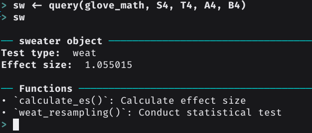

```{r setup, include=FALSE}
library(learnr)
knitr::opts_chunk$set(echo = FALSE)
```

## read_word2vec


The main purpose of sweater is to evaluate associations among words in word embedding spaces.

Unwanted associations = biases

You can train your own word embeddings. `sweater` also provides the function `read_word2vec` to read pretrained word embeddings efficiently.

### a demo of read_word2vec

The word embedding file is 5.3GB! gensim needs 10 minutes to read it.

Here < 1min.

```{r read, exercise=TRUE}
require(sweater)
big_glove <- read_word2vec("~/dev/sweater/raw_data/glove.840B.300d.txt")
dim(big_glove)
```

## query

We use the concept of query to look for biases.

A query requires two sets of words: Target words ($\mathcal{S}$, $\mathcal{T}$) and Attribute words ($\mathcal{A}$, $\mathcal{B}$).

**Target words** ($\mathcal{S}$, $\mathcal{T}$) should have no bias.

**Attribute words** ($\mathcal{A}$, $\mathcal{B}$) are attributes in relation to the bias.

| Method                           | Target words                 | Attribute words              |
|----------------------------------|------------------------------|------------------------------|
| Mean Average Cosine Similarity   | $\mathcal{S}$                | $\mathcal{A}$                |
| Relative Norm Distance           | $\mathcal{S}$                | $\mathcal{A}$, $\mathcal{B}$ |
| Relative Negative Sentiment Bias | $\mathcal{S}$                | $\mathcal{A}$, $\mathcal{B}$ |
| SemAxis                          | $\mathcal{S}$                | $\mathcal{A}$, $\mathcal{B}$ |
| Normalized Association Score     | $\mathcal{S}$                | $\mathcal{A}$, $\mathcal{B}$ |
| Embedding Coherence Test         | $\mathcal{S}$                | $\mathcal{A}$, $\mathcal{B}$ |
| Word Embedding Association Test  | $\mathcal{S}$, $\mathcal{T}$ | $\mathcal{A}$, $\mathcal{B}$ |

```r
query(w, S_words, T_words, A_words, B_words, method = "guess", verbose = FALSE)
```

## Example: Garg et al.

Gender biases of occupation words in the pretrained Google News Word Embeddings 

```{r garg2, exercise=TRUE, exercise.lines = 30}
require(sweater)
S1 <- c("janitor", "statistician", "midwife", "nurse",
"engineer", "teacher", "author", "secretary", "soldier")

A1 <- c("he", "son", "his", "him", "father", "man", "boy", "himself", 
"male", "brother", "sons", "fathers", "men", "boys", "males", 
"brothers", "uncle", "uncles", "nephew", "nephews")

B1 <- c("she", "daughter", "hers", "her", "mother", "woman", "girl", 
"herself", "female", "sister", "daughters", "mothers", "women", 
"girls", "females", "sisters", "aunt", "aunts", "niece", "nieces"
)
query(googlenews, S_words = S1, A_words = A1, B_words = B1)
```

## Plot

```{r garg2_plot, exercise=TRUE, exercise.lines = 30}
require(sweater)

S1 <- c("janitor", "statistician", "midwife", "nurse",
"engineer", "teacher", "author", "secretary", "soldier")

A1 <- c("he", "son", "his", "him", "father", "man", "boy", "himself", 
"male", "brother", "sons", "fathers", "men", "boys", "males", 
"brothers", "uncle", "uncles", "nephew", "nephews")

B1 <- c("she", "daughter", "hers", "her", "mother", "woman", "girl", 
"herself", "female", "sister", "daughters", "mothers", "women", 
"girls", "females", "sisters", "aunt", "aunts", "niece", "nieces"
)
garg_f1 <- query(googlenews, S_words = S1, A_words = A1, B_words = B1)
plot(garg_f1)
```

## Example: ICA abstracts

Are these words implicitly associated with R or Python in ICA 2022 abstracts?

```{r caliskan, exercise = TRUE, exercise.lines = 30}
require(sweater)
ica_program_wm <- readRDS("~/dev/sweater/paper/tooldemo2022/data/ica_program_wm.RDS")
S_words <- c("analysis", "analytic", "computation", "computational", "analyses",
"computer", "vision", "statistics", "software", "tool")
A_words <- c("r")
B_words <- c("python")

x <- query(ica_program_wm, S_words = S_words, A_words = A_words, B_words = B_words,
           method = "ect")
plot(x)
```

## Supers



* efficient (C++, RCpp)
* easy to use
* nice documentation
* nice interface (Guide you what to do next)
* nice integration with existing R packages (rsparse, word2vec, text2vec,
quanteda)


### R

```r
require(sweater)

big_glove <- read_word2vec("glove.840B.300d.txt")

S2 <- c("math", "algebra", "geometry", "calculus", "equations",
        "computation", "numbers", "addition")
T2 <- c("poetry", "art", "dance", "literature", "novel", "symphony",
        "drama", "sculpture")
A2 <- c("male", "man", "boy", "brother", "he", "him", "his", "son")
B2 <- c("female", "woman", "girl", "sister", "she", "her", "hers",
        "daughter")
query(big_glove, S2, T2, A2, B2, method = "weat")
```

### Python

```python
from wefe.query import Query
from wefe.word_embedding_model import WordEmbeddingModel
from wefe.metrics.WEAT import WEAT
from gensim.models import KeyedVectors
from gensim.scripts.glove2word2vec import glove2word2vec
from gensim.test.utils import datapath, get_tmpfile

# load_word2vec_format can't read glove file directly.
# if you want to do it "directly"

glove_file = datapath('/home/chainsawriot/dev/sweater/paper/glove.840B.300d.txt')

tmp_file = get_tmpfile("test_word2vec.txt")

_ = glove2word2vec(glove_file, tmp_file)

glove_embeddings = WordEmbeddingModel(KeyedVectors.load_word2vec_format(tmp_file), "word2vec")

target_sets = [["math", "algebra", "geometry", "calculus", "equations",
        "computation", "numbers", "addition"], ["poetry", "art", "dance", "literature", "novel", "symphony",
        "drama", "sculpture"]]
attribute_sets = [["male", "man", "boy", "brother", "he", "him", "his", "son"], ["female", "woman", "girl", "sister", "she", "her", "hers",
        "daughter"]]

attribute_sets_names = ['A', 'B']
target_sets_names = ['S', 'T']

query = Query(target_sets, attribute_sets, target_sets_names, attribute_sets_names)

weat = WEAT()
result = weat.run_query(query, glove_embeddings, calculate_p_value = False)
print(result)
```

### Java

```java
import java.util.Arrays;
public class WeatBenchmark {
	public static void main(String[] args) throws Exception{
    	String semanticModel="glove.840B.300d.txt";
    	int wordDimension =300;
    	String delimiter =" ";	//dimension delimiter in the word embeddings
    	boolean caseSensitive=true; //prefer case sensitivity
    	boolean checkWordPresence=true;
    	int iterations = 1000000;
    	String distribution = "normal";
    	    	
    	String[] target1 = {"math" , "algebra" , "geometry" , "calculus" , "equations" , "computation" , "numbers" , "addition"};
    	String[] target2 = {"poetry" , "art" , "sculpture" , "dance" , "literature" , "novel" , "symphony" , "drama"};
    	String[] attribute1 = {"brother" , "male" , "man" , "boy" , "son" , "he" , "his" , "him"};
    	String[] attribute2 = {"sister" , "female" , "woman" , "girl" , "daughter" , "she" , "hers" , "her"};
	if(checkWordPresence == true){
	    //remove words from categories if they do not exist
	    target1 = Utils.removeCategoryWordsIfNotInDictionary(target1, semanticModel, wordDimension, delimiter, caseSensitive);
	    target2 = Utils.removeCategoryWordsIfNotInDictionary(target2, semanticModel, wordDimension, delimiter, caseSensitive);
	    attribute1 = Utils.removeCategoryWordsIfNotInDictionary(attribute1, semanticModel, wordDimension, delimiter, caseSensitive);
	    attribute2 = Utils.removeCategoryWordsIfNotInDictionary(attribute2, semanticModel, wordDimension, delimiter, caseSensitive);
	}
	double ts = Utils.getTestStatistic(target1, target2, attribute1, attribute2,  caseSensitive,  semanticModel,  wordDimension,  delimiter);
	// Actually this function doesn't need the iterations param,
	// but it is included in the params; but I don't want to modify Utils.java
	double [] entireDistribution = Utils.getEntireDistribution(target1, target2, attribute1, attribute2,  caseSensitive,  semanticModel,  wordDimension,  delimiter, iterations); 
	double es = Utils.effectSize(entireDistribution, ts);
	System.out.println("effectSize: "+ es );
    	}
}
```

## Use it now

```{r install, exercise = TRUE}
install.packages("sweater")
remotes::install_github("chainsawriot/sweater")
```

### Citation:

Chan, C., (2022). sweater: Speedy Word Embedding Association Test and Extras Using R. Journal of Open Source Software, 7(72), 4036, https://doi.org/10.21105/joss.04036

### Funding

The development of this package was supported by the Federal Ministry for Family Affairs, Senior Citizens, Women and Youth (*Bundesministerium für Familie, Senioren, Frauen und Jugend*), the Federal Republic of Germany -- Research project: "*Erfahrungen von Alltagsrassismus und medienvermittelter Rassismus in der (politischen) Öffentlichkeit*".
